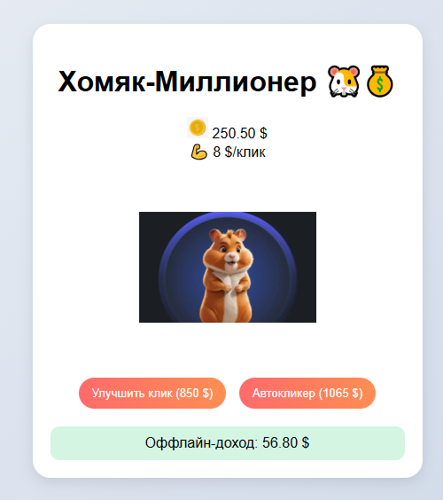

# 🐹 Хомяк-Миллионер (Hamster Clicker)

Простая инкрементальная игра на Flask, где нужно кликать по хомяку, зарабатывать деньги и покупать улучшения.



## ✨ Особенности
- Кликер с милым хомяком
- Система улучшений (увеличение дохода за клик)
- Автокликеры (пассивный доход)
- Оффлайн-доход (зарабатывайте, даже когда игра закрыта)
- Частицы денег при кликах
- Сохранение прогресса в браузере


🛠 Технологии
Python 3.9+

Flask 2.3

HTML5/CSS3

JavaScript (ES6)

LocalStorage (сохранение прогресса)

🔧 Возможные улучшения
Добавить больше видов улучшений

Реализовать систему достижений

Добавить фоновую музыку

Сделать мобильную версию

📜 создатель Сергей.П.В

🐭 Happy clicking! Зарабатывайте миллионы с помощью хомяка!

text


Файл поддерживает:
- Красивую визуализацию на GitHub/GitLab
- Подсветку синтаксиса
- Emoji-иконки
- Четкую структуру проекта


📁 Структура проекта
   ```bash
hamster-clicker/
├── app.py                # Основное приложение Flask
├── requirements.txt      # Зависимости
├── static/
│   ├── css/
│   │   └── style.css    # Стили игры
│   ├── js/
│   │   └── script.js    # Логика игры
│   └── images/          # Изображения хомяка и монеток
├── templates/
│   └── index.html       # Главная страница
└── README.md            # Этот файл


 🚀 Установка
1. Клонируйте репозиторий:

git clone https://github.com/ваш-username/hamster-clicker.git
   cd hamster-clicker
  
   
pip install -r requirements.txt
   hamster-clicker/

   
